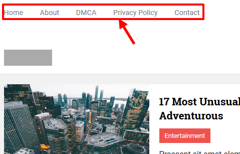

Laman
=====

Posisi **widget laman** berada pada pojok kiri-atas header. Widget ini bisa berisi link internal ataupun eksternal.

Menambahkan Laman
-----------------

1. Buka menu **Layout/ Tata Letak** pada dasbor  `Blogger <https://www.blogger.com/>`_.

2. Klik Edit pada widget **Pages**.

3. Centang laman yang ingin ditambahkan

atau

Klik **+ Tambahkan tautan eksternal** jika ingin menambahkan URL Eksternal.

4. Simpan.

Menghappus Laman
----------------
