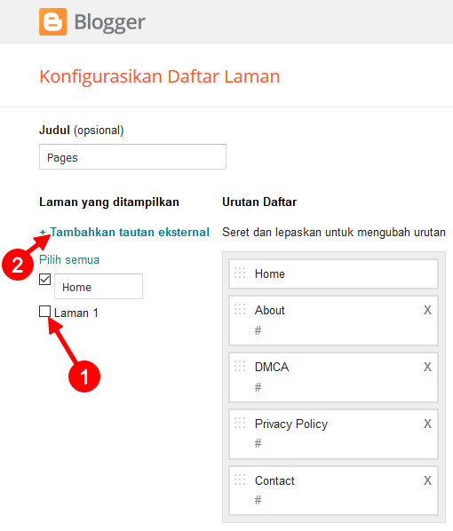

Laman
=====

Posisi **widget laman** berada pada pojok kiri-atas header. Widget ini bisa berisi link internal ataupun eksternal.

.. _Menambahkan Laman

Menambahkan Laman
-----------------

1. Buka menu **Layout/ Tata Letak** pada dasbor  `Blogger <https://www.blogger.com/>`_.

2. Klik **Edit** pada widget **Pages**.

.. image:: _static/laman/1.png

3. Centang laman yang ingin ditambahkan **(1)** atau klik **"+ Tambahkan tautan eksternal"** jika ingin menambahkan URL Eksternal **(2)**.

4. Simpan.

Menghapus Laman
----------------

1. Lakukan langkah 1 dan 2 seperti pada bagian :ref:`Menambahkan Laman`.

2. Klik tanda **X** untuk menghapus laman yang Anda inginkan.

.. image:: _static/laman/3.png

3. Simpan.
